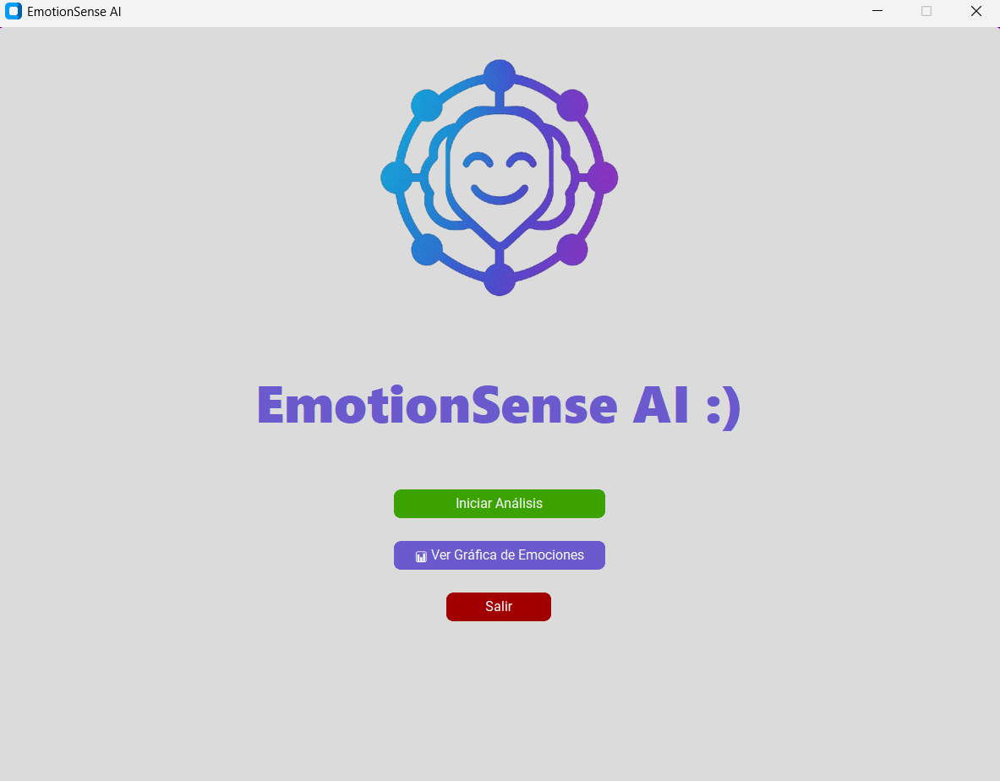
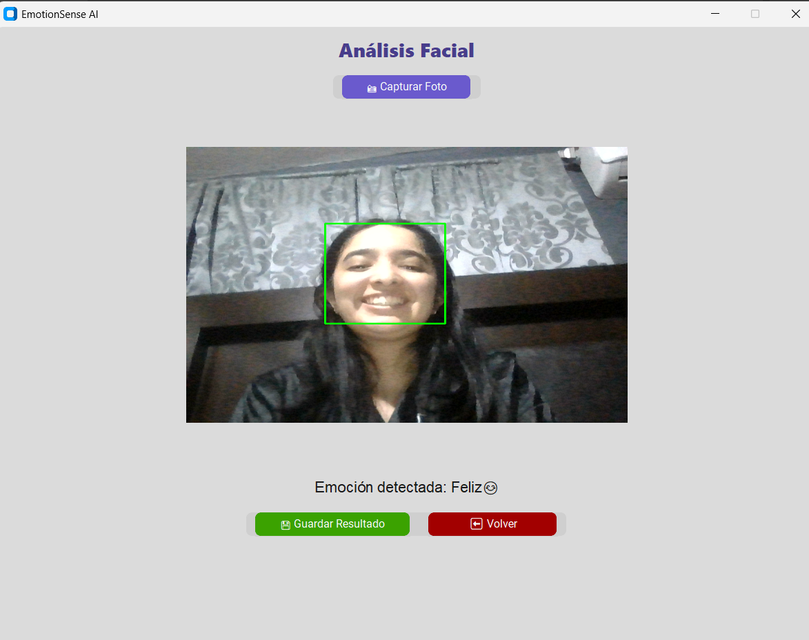
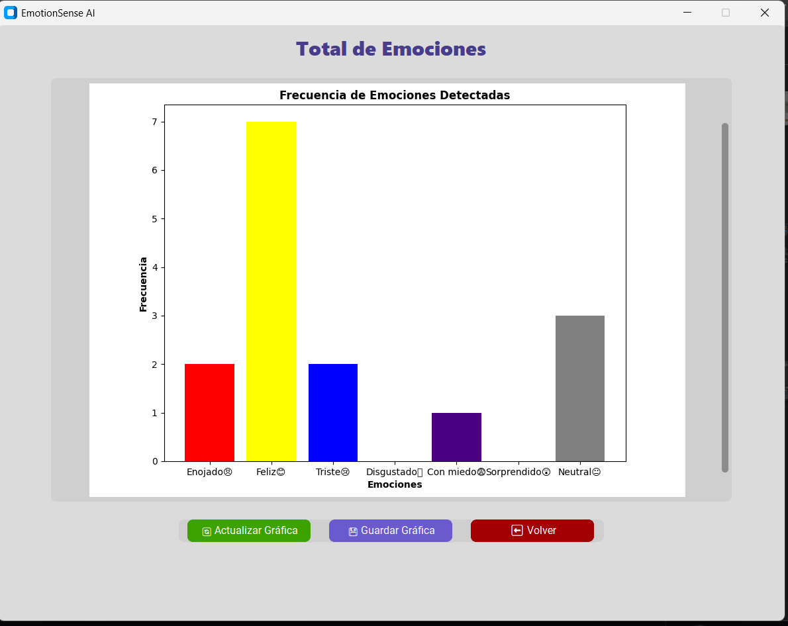

# EmotionSense AI

## 📌 Descripción
EmotionSense AI es una aplicación de escritorio desarrollada en Python que utiliza inteligencia artificial y visión por computadora para detectar emociones humanas a partir del análisis de expresiones faciales en tiempo real.

El sistema permite capturar imágenes desde la cámara web, identificar el rostro, analizar la emoción predominante y generar un historial con gráficas de frecuencia emocional.

---

## 🎯 Objetivo
Desarrollar una herramienta capaz de reconocer y clasificar emociones humanas mediante el análisis facial, facilitando el estudio del estado emocional en distintos contextos como bienestar, educación, marketing y atención al cliente.

---

## ⚙️ Funcionamiento
1. Captura de imagen desde la cámara web.
2. Detección del rostro utilizando OpenCV.
3. Análisis de expresiones faciales mediante DeepFace.
4. Traducción de emociones al español con emojis.
5. Visualización del resultado en tiempo real.
6. Almacenamiento del historial de emociones.
7. Generación de gráficas estadísticas por emoción.

---

## 🛠️ Tecnologías utilizadas
- Python  
- CustomTkinter (interfaz gráfica)
- OpenCV  
- DeepFace  
- PIL (manejo de imágenes)
- Matplotlib (gráficas)
- NumPy  
- Threading  

---

## 🖥️ Interfaz
La aplicación cuenta con:
- Pantalla de inicio
- Módulo de análisis facial en tiempo real
- Historial de emociones con gráfica estadística
- Diseño visual con colores personalizados y botones interactivos

---

## 📸 Capturas del sistema
Las capturas del funcionamiento y diseño de la aplicación se encuentran en la carpeta `screenshots`.

